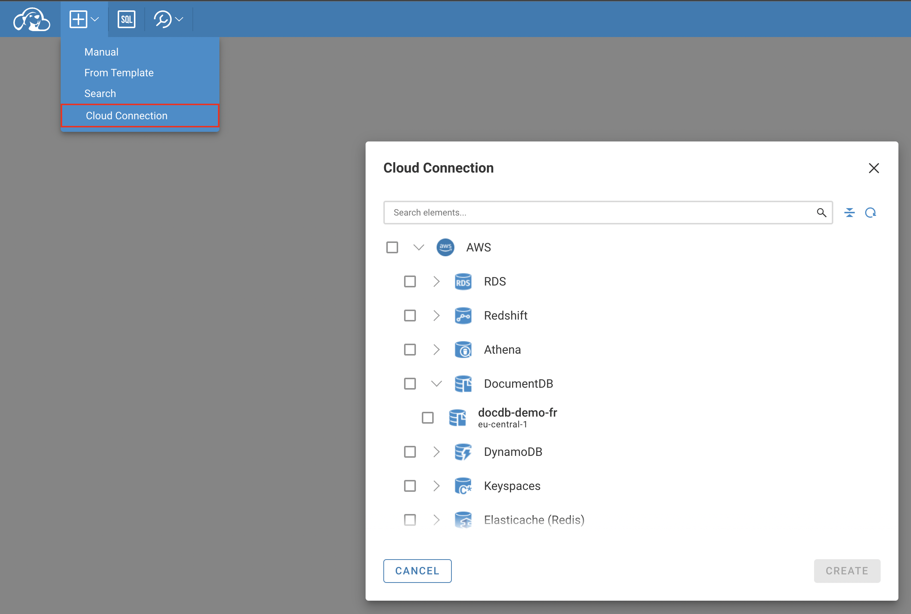

Once you configure the [[AWS Settings|AWS-Settings]] you can open the Cloud Connection dialog and start adding AWS database connections. You can add connection from the Public part of the app.

In the center of the Cloud Explorer you can see AWS databases in a hierarchical view. All databases are grouped by database/service type. When you expand one of the top elements, CloudBeaver will start to search AWS databases considering the regions you have selected in the [[AWS Settings|AWS-Settings]] section.

If you have a large number of databases in your cloud, you can filter them using filter text above the cloud tree.
You can also check any number of databases in the Cloud Explorer using the checkbox control on the left side of the Cloud Explorer tree.