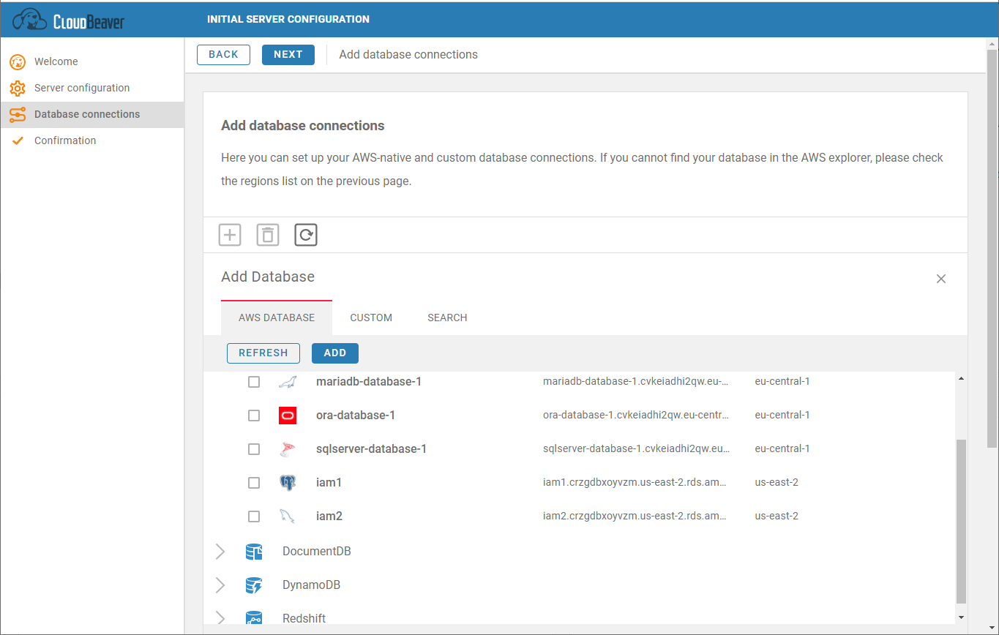

## AWS Marketplace

You can subscribe to CloudBeaver EE in the AWS Marketplace here: https://aws.amazon.com/marketplace/pp/B08QTY2JTF.  

There is one month of trial period.  

## Docker image

Not yet supported. We are working on the new docker image for AWS version of CloudBeaver.  

## Cloud explorer

You can use an embedded cloud explorer in order to find and add existing AWS databases:

