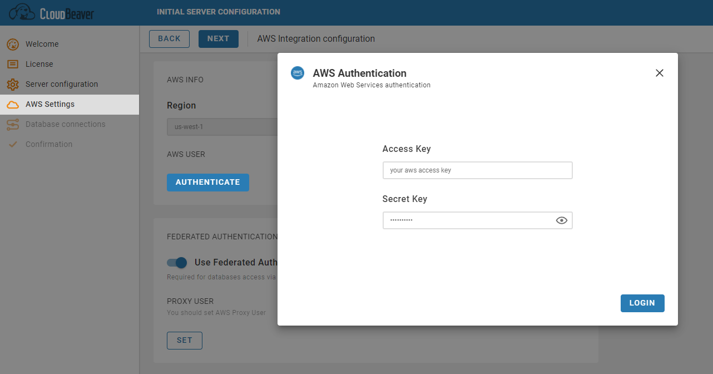
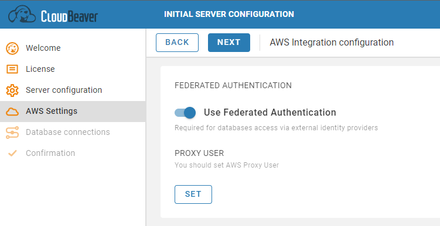
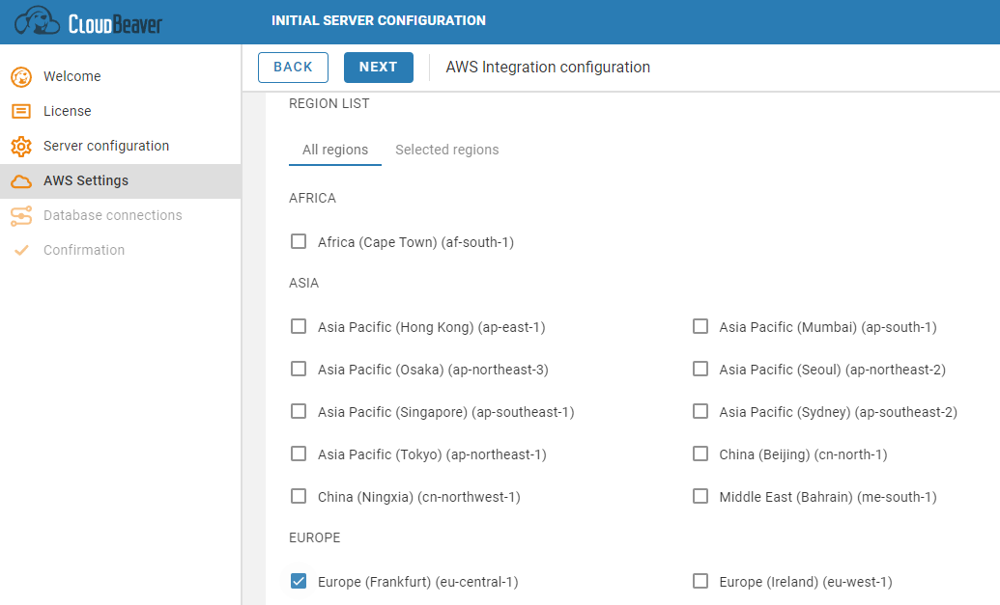

## Authentication
To get access to the AWS Services from the CloudBeaver you need to authenticate to your AWS Account. All CloudBeaver AWS settings will depend on this AWS account permissions. <u>You will not be able to change entered AWS credentials after the end of configuration process.</u> Also, these credentials will be automatically assigned to the administrator in CloudBeaver. We highly recommend to create a special AWS user with all required permissions for the administrator account. 
You can learn more about AWS Authentication [[here|AWS-IAM]].

## Federated Authentication
Here you can setup a proxy user to be able to connect to the AWS Services via SSO. You can learn more about it in [[this article|Single-Sign-On]].

## Regions
When you view your AWS Resources in the CloudBeaver, you see only the resources that are tied to the AWS Region that you specified in this step. For example, when you search for the AWS databases in [[Cloud Explorer|AWS-Cloud-explorer]], you see only the databases that exist in these specific regions. Regions can be configurated later in the [[Administration|Administration]] section.

