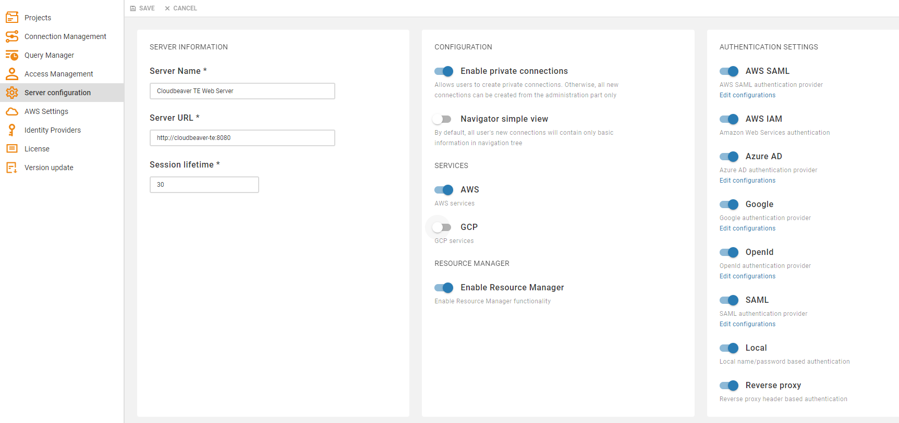
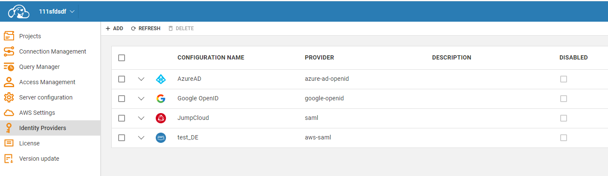

# DBeaver Team Edition configuration

## License import

You need a license in order to start working with CloudBeaver.  
Use the same instruction as for other CloudBeaver products: [[Licnese Management|CloudBeaver-License-Management]]

## Authentication configuration

You can use different ways to manage and authenticate your users.

### Local users

Local users are stored in CloudBeaver internal database. You need to create local users manually and specify username and password for them.  
User can change its password later.
See "<a href="#creating-users">creating users</a>" for more details.

### Federated authentication

You can keep third party catalog service like Active Directory to keep your users and manager authentication. To use them in DBeaver/CloudBeaver your need to configure identity provider(s).  
1. Go to administration panel, switch to tab "Server Configuration" and enable needed services and authenetication methods:

2. Got to "Identity providers" tab and configure federated authentication:

Below is the list of supported identity providers:

#### Azure AD

You can configure Azure AD integration so users will bne stored in AD. There is not need to manage their credentials or teams manually.

#### Google GSuite

#### AWS SSO

#### OpenId

#### SAML

## Creating users

## Creating teams

## Managing projects

