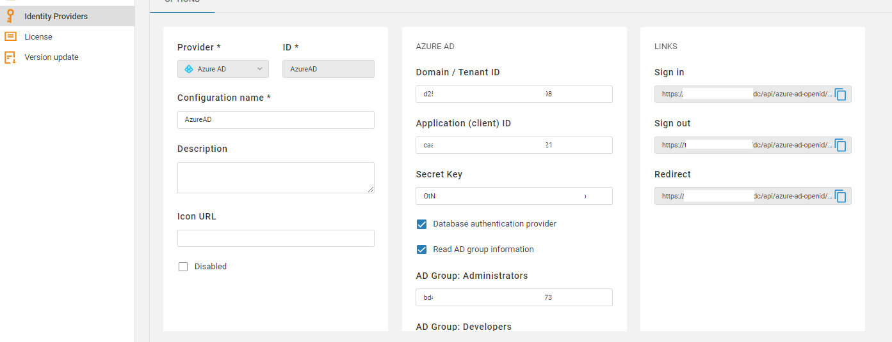

## Initial login

Use the default credentials to login:

**User name**: `cbadmin`
**User password**: `cbadmin20`

## License import

You need a license in order to start working with CloudBeaver.  
Use the same instruction as for other CloudBeaver products: [[Licnese Management|CloudBeaver-License-Management]]

## Authentication configuration

You can use different ways to manage and authenticate your users.

### Local users

Local users are stored in CloudBeaver internal database. You need to create local users manually and specify username and password for them.  
User can change its password later.
See "<a href="#creating-users">creating users</a>" for more details.

### Federated authentication

You can keep third party catalog service like Active Directory to keep your users and manager authentication. To use them in DBeaver/CloudBeaver your need to configure identity provider(s).  
1. Go to administration panel, switch to tab "Server Configuration" and enable needed services and authenetication methods:

2. Got to "Identity providers" tab and configure federated authentication:

Below is the list of supported identity providers:

#### Azure AD

You can configure Azure AD integration so users will be stored in AD. There is no need to manage their credentials or teams manually.

You need to specify following parameters:

Name | Description
---|---
Domain / Tenant ID | Azure AD domain name or tenant ID
Application ID | Azure AD enterprise application ID (the same as client ID in OpenID auth)
Secret Key | Azure AD enterprise application client secret key
Database authentication provider | If checked then access to SQL Server will be claimed along with user information. Open ID scope = `https://database.windows.net//.default`
Read AD group information | If checked then user AD groups information will be claimed. It is needed to associate AD user with CludBeaver roles. Open ID scope = `groups`.
AD Group: Administrators | AD group identitiers (coma separated). Users from these groups will be granted with Administrator role
AD Group: Developers | AD group identitiers (coma separated). Users from these groups will be granted with Developer role
AD Group: Managers | AD group identitiers (coma separated). Users from these groups will be granted with Manager role

Note: users will be created in CloudBeaver automatically on first login.
User ID will the same as user email in Azure AD.

#### Google GSuite

You need to specify following parameters:

Name | Description
---|---
Client ID | Client ID from GSuite OpenID credentials
Client Secret | Client secret from GSuite OpenID credentials
IDP auth endpoint | `https://accounts.google.com/o/oauth2/auth`
IDP token endpoint | `https://oauth2.googleapis.com/token`

Note: users will be created in CloudBeaver automatically on first login.
User ID will the same as user email in GSuite.

<!--
#### AWS SSO

#### OpenId

#### SAML

## Creating users

## Creating teams

## Managing projects

-->